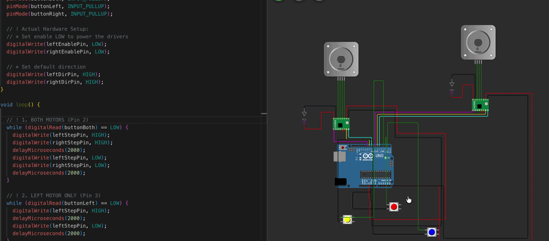
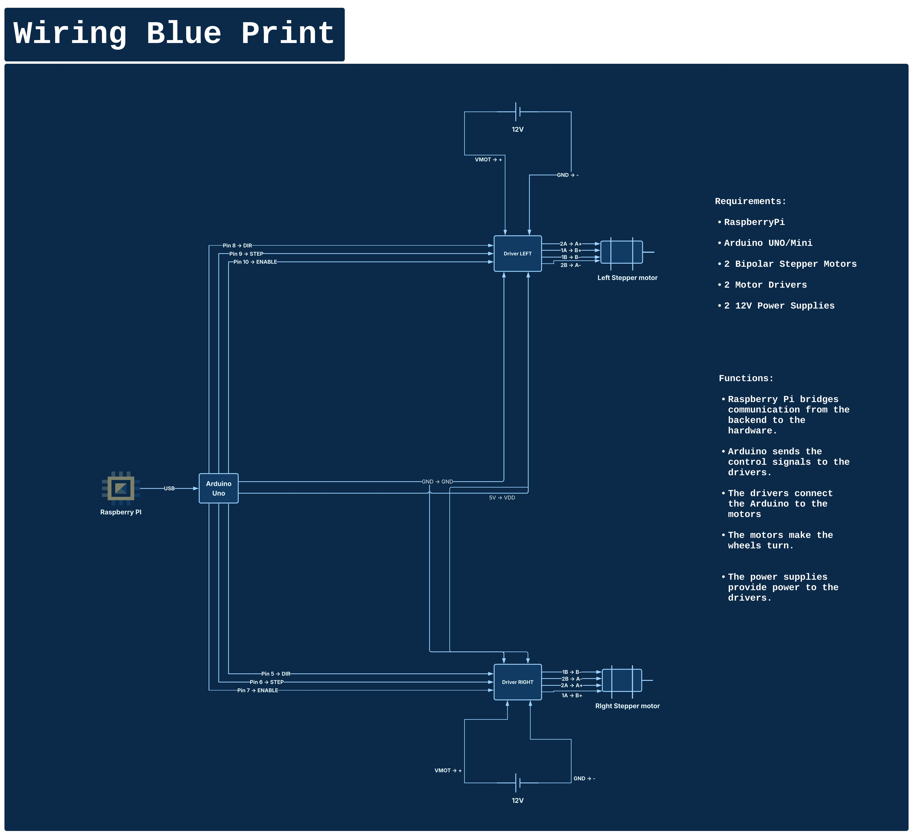
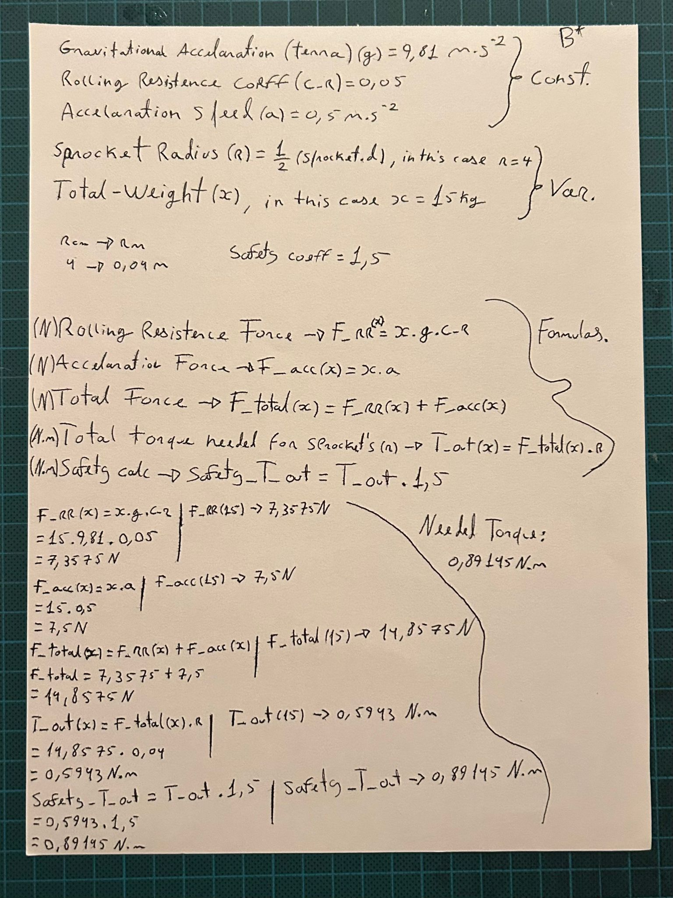
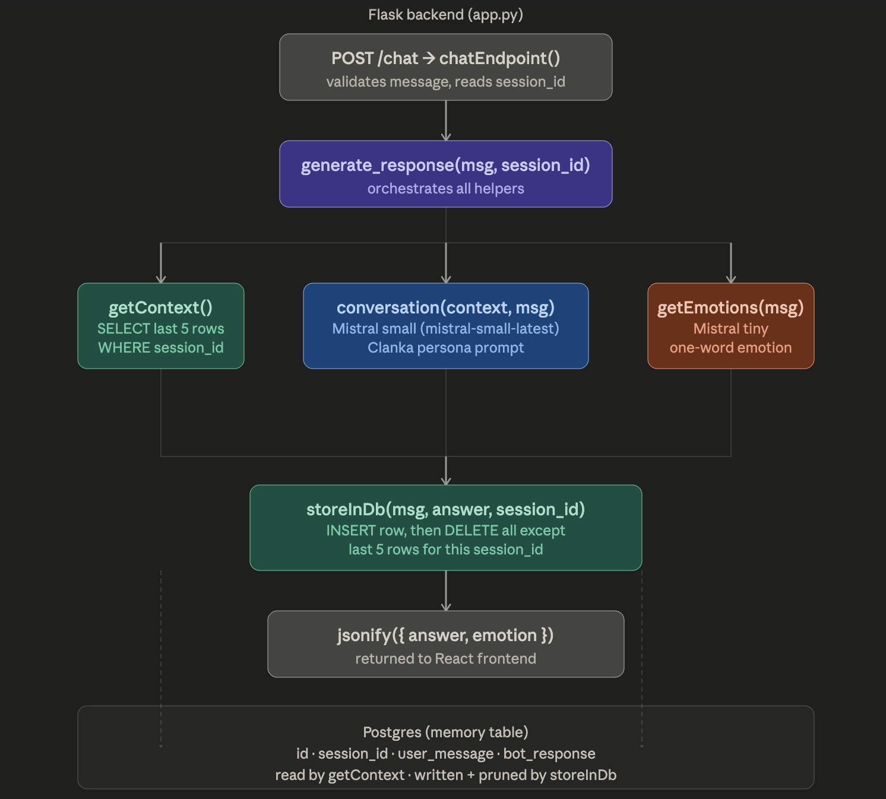
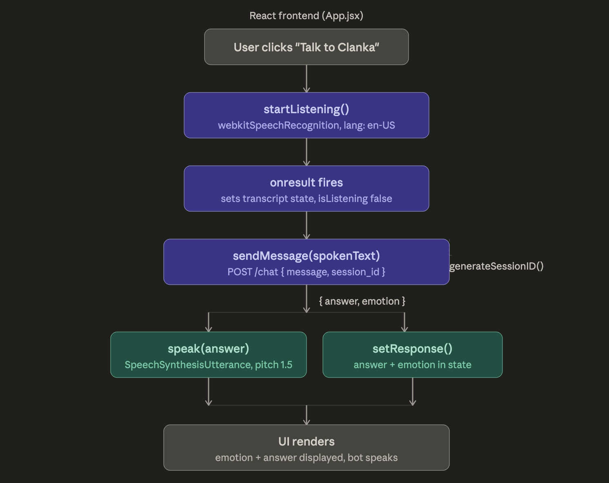

# Clanka



## robot friend, still in the begining of the begginings but Clanka is supposed to be an ai friend powered by Mistral AI that portrais emotions, that you can control remotely and eventually be automatic.


## Hardware & Engineering
Clanka is built on a custom-designed chassis with mechanical tolerances.

### Mechanical Design
Detailed technical drawings for the chassis:
- **Sprocket Design:** $R=40\text{mm}$ ([View PDF](assets/D_Sprocket.pdf))
- **Base Plate:** $450\text{mm} \times 370\text{mm}$ ([View PDF](assets/D_Base.pdf))
- **Enclosure:** Custom Box Design ([View PDF](assets/D_Box.pdf))
- **Motor Specs:** DC/Stepper mounting specs ([View PDF](assets/D_DC-motor.pdf))
  

### Wiring Diagram
Refer to the blueprint below for pin mapping between the Raspberry Pi, Arduino Uno, and A4988 drivers.
([View PDF](assets/main-components-diagram.pdf))



### Core Idea Sketch + Values


### Torque Analysis
Calculations were performed to ensure motors could withstand the load.


## Software

### Flux Diagrams

### Backend


### Frontend



## Live demo

[https://clanka-eight.vercel.app](https://clanka-eight.vercel.app)

a bit slow sometimes on start but once it runs it runs

## Tech Stack

```
* **Microcontroller:** Arduino Nano (C++) — may migrate to Uno
* **SBC:** Raspberry Pi 3B (Python Backend)
* **Frontend** Vite + React
* **Backend** Flask + PostgresSQL
* **Motor Control:** 2x NEMA 17 Stepper Motors + A4988 Drivers
* **Communication:** Serial/USB Bridge
```


# Run

## Install dependencies
```
pip install -r requirements.txt
```

## Mistral API key
```
Go to console.mistral.ai
Sign up or log in
Go to API Keys in the sidebar
Click Create new key, give it a name
Copy it — cuz you won't see it again
Paste it in your .env file:
```

## PostgresSQL set up
```
# macOS
brew install postgresql

# Ubuntu/Linux
sudo apt install postgresql

# Windows — download installer from postgresql.org

```

## backend (Brains)
```
cd backend
python3 main.py
```

## frontend (Visual)
```
cd frontend
npm run dev
```


